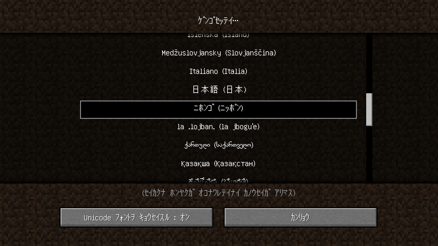

# MC Lang ja_jp@hwkana

Minecraft language pack to add Japanese [half-width kana](https://en.wikipedia.org/wiki/Half-width_kana).

Minecraft ﾉ ｹﾞﾝｺﾞｾｯﾃｲﾆ ﾊﾝｶｸｶﾅﾋｮｳｷﾉ ﾆﾎﾝｺﾞｦ ﾂｲｶｽﾙ ﾘｿｰｽﾊﾟｯｸﾃﾞｽ｡

|  | Value |
| --- | --- |
| Language Code | `ja_jp@hwkana` |
| Language Name | `ﾆﾎﾝｺﾞ` |
| Language Region | `ﾆｯﾎﾟﾝ` |

## Download

- [Download latest](https://github.com/Iunius118/MCLangJaJpHWKana/releases/latest) (ｻｲｼﾝﾊﾞﾝ)
- [Download for 1.12.x](https://github.com/Iunius118/MCLangJaJpHWKana/releases/download/1.17-20211126.1/lang_ja_jp_hwkana-1.12-20211126.1.zip) (`lang_ja_jp_hwkana-1.12-20211126.1.zip`)

## License

- Use or fork within the scope of the [Minecraft EULA](https://account.mojang.com/documents/minecraft_eula).  
｢[Minecraft ｴﾝﾄﾞ ﾕｰｻﾞｰ ﾗｲｾﾝｽｼﾞｮｳｺｳ](https://account.mojang.com/documents/minecraft_eula)｣ ﾉ ﾊﾝｲﾅｲﾃﾞ ｺﾞｼﾖｳ ｸﾀﾞｻｲ｡
